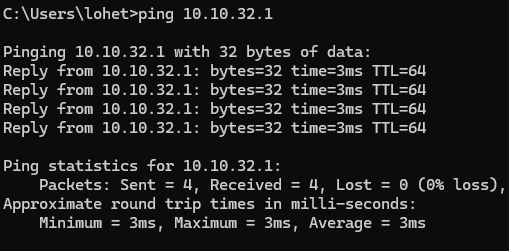
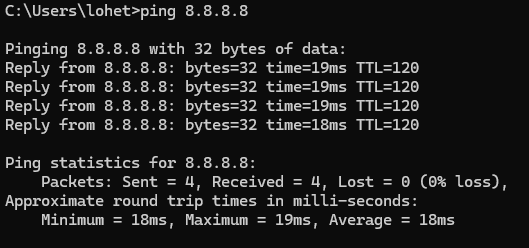
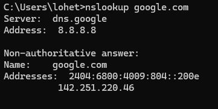
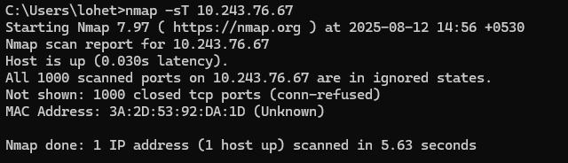

### Chapter 1, Section 3: Apply

This section documents the hands-on labs where I applied foundational networking concepts to troubleshoot a common problem and perform network reconnaissance.

---
#### Troubleshooting Scenario

**Objective:** To systematically diagnose why a PC can't reach a website by testing connectivity in layers.

**Process & Findings:**
I followed a step-by-step process to isolate the point of failure.

1.  **Pinging the Default Gateway:** This first test confirmed that my local network connection between my PC and router was working correctly.
    

2.  **Pinging a Public DNS Server:** This second test confirmed that I had a live connection to the internet.
    

3.  **Testing DNS with `nslookup`:** This final test revealed that the issue was with DNS resolution, as my PC was unable to translate the domain name "google.com" into an IP address.
    

---
#### Network Scanning with Nmap

**Objective:** To use Nmap to identify open ports and infer running services on a target machine in a controlled lab environment.

**Process & Findings:**
I performed a basic TCP Connect scan (`nmap -sT`) against a target machine on my lab network. The results below show the open ports that were discovered.

**Analysis:** The scan revealed that port 80 (http) was open, which indicates that the target machine is running a web server. This exercise demonstrates how Nmap can be used for initial network reconnaissance.
