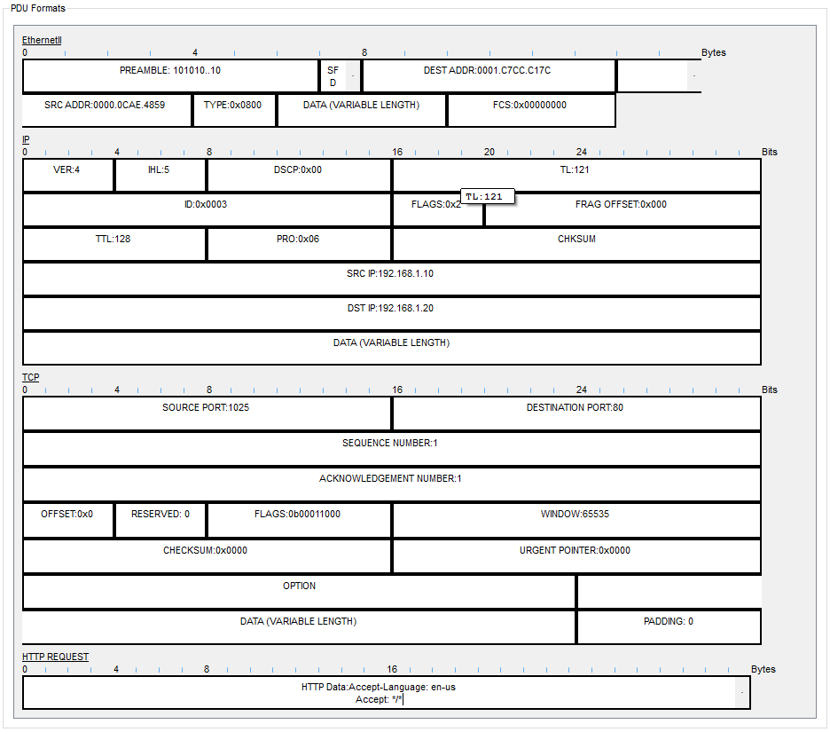
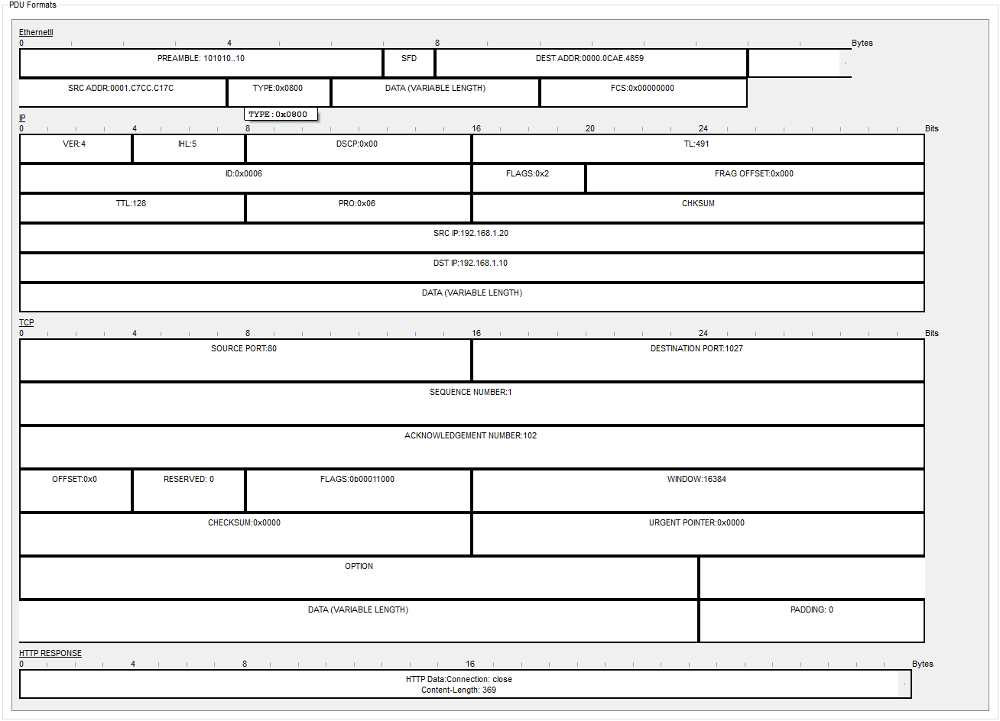

### Packet Tracer Simulation: Visualizing Encapsulation in Action

I built a simple client-server topology in Cisco Packet Tracer to observe how Protocol Data Units (PDUs) are constructed and deconstructed during an HTTP request. This hands-on lab visually demonstrates the core concepts of encapsulation and decapsulation.

#### 1. The Outgoing Request: Encapsulation

The following screenshot shows the outbound PDU details on the client PC as it prepares to send the HTTP request. You can clearly see how each layer adds its own header—wrapping the data from the layer above it—before sending the final frame.

#### 2. The Return Response

This second screenshot shows the HTTP response packet sent from the server back to the client. It's a great example of how the source and destination IP addresses and ports are swapped for the return journey.

